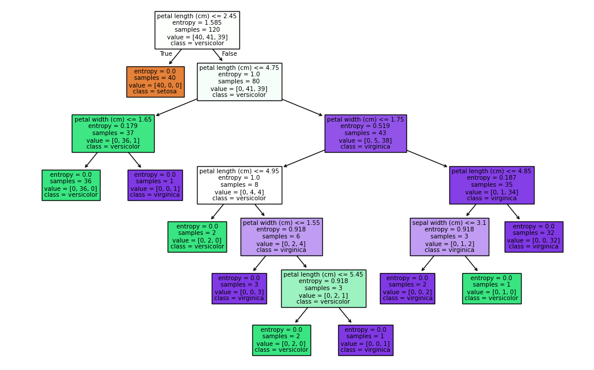

# Implement-a-Decision-Tree-Classifier-using-the-classic-Iris-dataset

# 🌸 Decision Tree Classifier on Iris Dataset  

This project demonstrates how to implement and visualize a **Decision Tree Classifier** using the classic **Iris dataset** in Python with `scikit-learn`.  

---

## 📘 About the Dataset  

The **Iris dataset** is one of the most popular datasets in machine learning, containing **150 samples** of iris flowers with **4 features**:  

- 🌿 Sepal length  
- 🌿 Sepal width  
- 🌸 Petal length  
- 🌸 Petal width  

The goal is to classify flowers into **three species**:  
- **Setosa**  
- **Versicolor**  
- **Virginica**  

---

## 🚀 Features  

- Train/Test split on the Iris dataset  
- Decision Tree Classifier with **Entropy Impurity**  
- Model training and prediction  
- Accuracy evaluation 
- Visualization of the Decision Tree structure
 

---
## 📈 Results

                                           

                                         

**Accuracy:** 1.0

